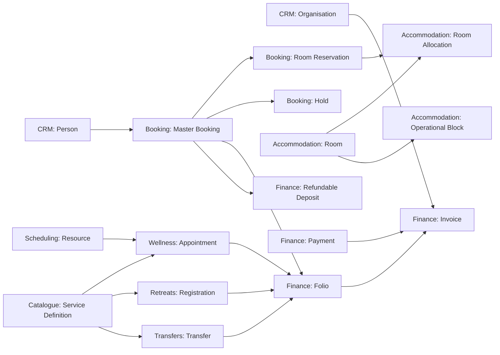

# Core Model

## Aggregate map

Arrows mean a reference or a published fact, not permission to change the destination aggregate. For example, Booking requests an allocation; Accommodation owns the allocation decision.

## Aggregate catalogue

| Aggregate | Owner | Purpose |
| --- | --- | --- |
| Person / Organisation | CRM | One identity and contact history for people and companies. |
| Master Booking | Booking | Commercial container linking a guest, party, room reservations and commercial terms. |
| Room Reservation | Booking | The independently changing commitment for one room and date range. |
| Hold | Booking | Expiring temporary reservation of category capacity. |
| Room | Accommodation | Physical sellable room and its supported configurations. |
| Room Allocation | Accommodation | Assignment of one confirmed reservation to one physical room for a time range. |
| Operational Block | Accommodation | Non-commercial reason that makes room capacity unavailable. |
| Folio | Finance | Mutable collection of billable charges and credits. |
| Invoice | Finance | Immutable issued payment document. |
| Payment | Finance | Received money and its allocations across invoices. |
| Refundable Deposit | Finance | Guest money held separately from revenue until returned or deducted. |
| Service Definition / Resource | Service catalogue & scheduling | Sellable offer and capacity needed to deliver it. |
| Wellness Appointment / Transfer / Retreat Registration | Specialist delivery modules | The MVP's independent service fulfilment lifecycles. |

## Value objects shared by the model

`Money(IDR)`, `StayPeriod`, `TimeRange`, `GuestCount`, `RoomConfiguration`, `ContactMethod`, `PartySnapshot`, `PriceSnapshot`, `CancellationPolicySnapshot`, `ActorReference`, `Approval`, `DocumentReference` and typed IDs are value objects. They do not have an independent lifecycle.

## Status ownership

The lifecycle `Inquiry → Hold → Confirmed → Checked In → Checked Out`, with `Cancelled` and `No Show` as end states, applies to a **Room Reservation**. A master booking may contain reservations in different states. Its displayed summary is derived from its children and is not a commandable replacement for their state.

`Payment Overdue` belongs to a Finance payment obligation (invoice/folio), not to Booking. A reservation remains `Confirmed` until an authorised cancellation changes it to `Cancelled` with reason `payment default`.
