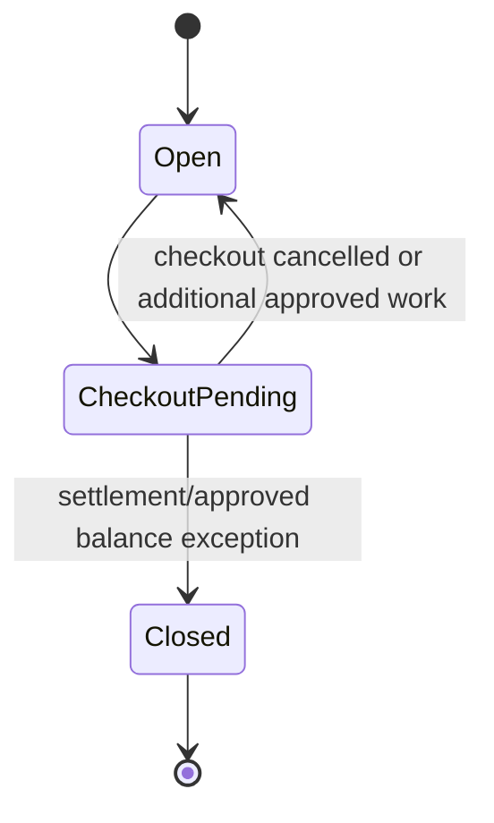
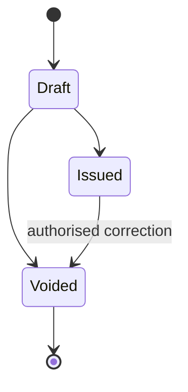
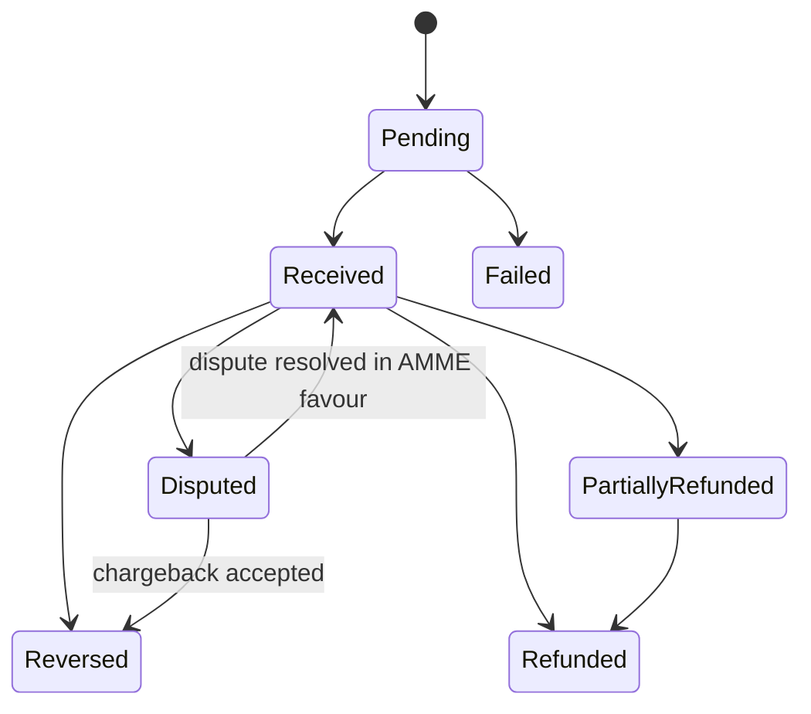
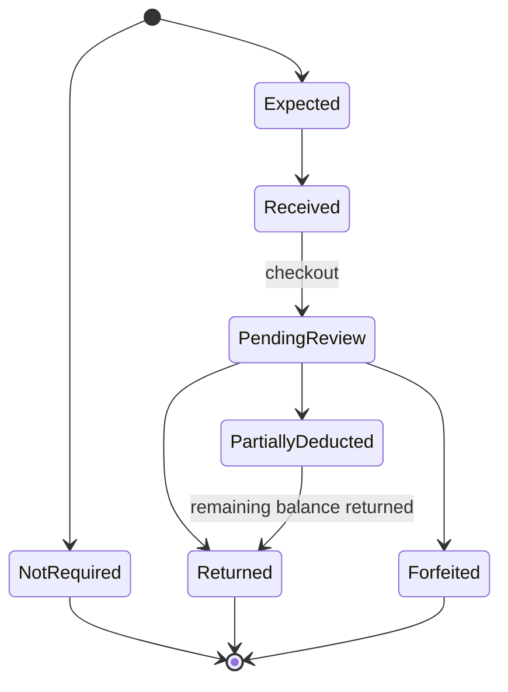

# Finance State Machines

## Folio

`Closed` is terminal for ordinary operations. Financial corrections use a new adjustment, reversal or refund operation; reopening is an exceptional owner/finance-admin action with audit record, not a normal transition.

## Invoice

Payment and collection are separate dimensions of an issued invoice:

| Dimension | States | Rule |
| --- | --- | --- |
| Payment status | Unpaid / Partially Paid / Paid | Derived from valid payment allocations. |
| Collection status | Current / Overdue | Derived from due date, grace period and outstanding balance. |

An issued invoice may be both `Partially Paid` and `Overdue`. It may be voided only through an authorised correction flow; Finance creates a replacement invoice where necessary. A draft can be voided before issue.

## Payment and allocation

`PaymentAllocation` is independently `Unallocated`, `Partially Allocated` or `Fully Allocated`. Allocating money changes allocation state, not the payment's receipt state. A reversed/refunded payment may not retain allocations above its valid remaining amount.

## Refundable Deposit

`Forfeited` means the full held amount was deducted through Manager-approved, auditable reason(s). `Partially Deducted` records a remaining refundable balance; it must ultimately be returned or replaced by an authorised correction.
