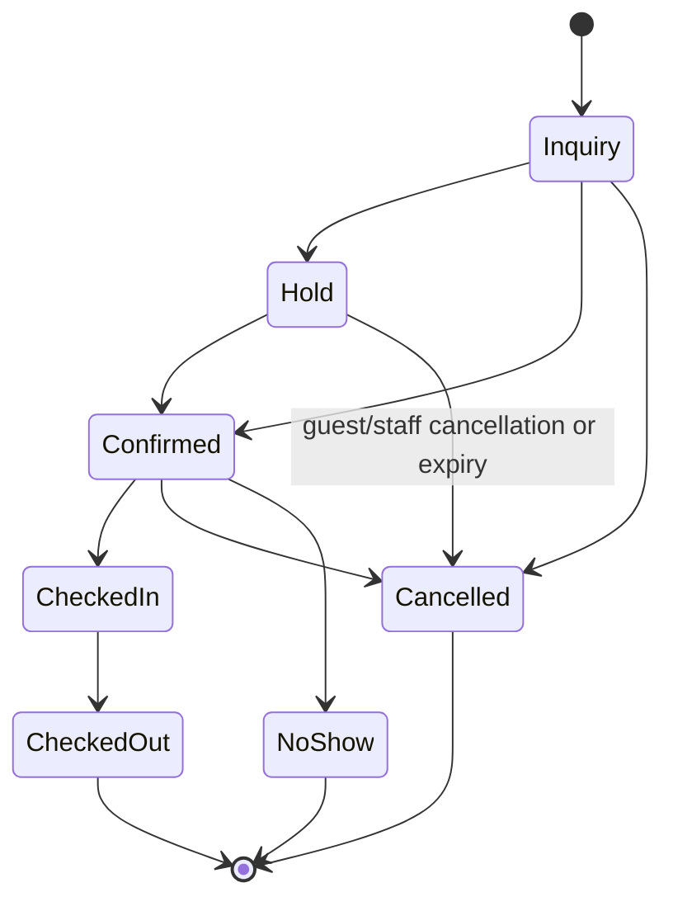
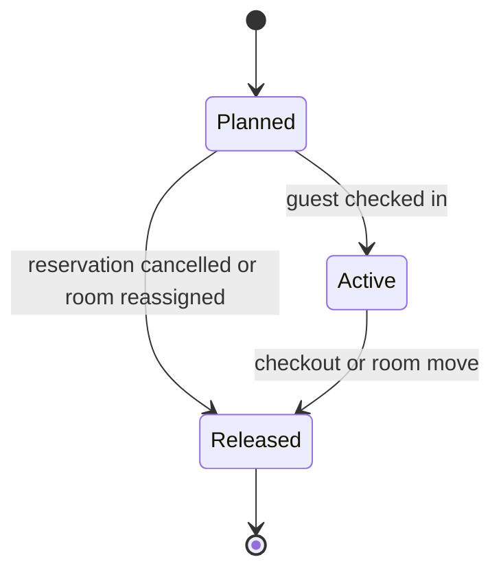

# Reservation and Room Allocation

## Room Reservation

| From | To | Trigger / authority | Required condition |
| --- | --- | --- | --- |
| Inquiry | Hold | Create Hold | Category capacity; hold policy and limit pass. |
| Inquiry | Confirmed | Confirm Reservation — Reception, Manager, Owner | Concrete room allocation and payment condition pass. |
| Inquiry | Cancelled | Cancel Reservation | Recorded reason. |
| Hold | Confirmed | Confirm Reservation — Reception, Manager, Owner | Hold is active; concrete allocation and payment condition pass. |
| Hold | Cancelled | Cancel, expiry process | Guest/staff cancellation or expiry deadline reached. |
| Confirmed | Checked In | Check In — authorised staff | Check-in identity and stay requirements pass. |
| Confirmed | Cancelled | Cancel Reservation — authorised staff | Cancellation policy outcome recorded. |
| Confirmed | No Show | Record No Show — staff | Arrival deadline and contact attempt recorded. |
| Checked In | Checked Out | Check Out — authorised staff | Folio is settled or an approved balance exception exists. |

`Cancelled` and `No Show` are terminal. Reinstatement is not a transition: only a Manager may create an authorised restore/rebooking action after availability validation. After `Checked In`, cancellation is forbidden; early or forced departure finishes through `Checked Out` with an appropriate reason.

## Room Allocation

`Planned` is created as part of reservation confirmation. A `Released` allocation is historical and immutable. A room move creates a new allocation; it does not modify the old one.
