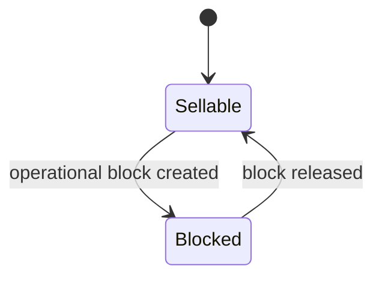

# Room Operations

## Operational state

```mermaid
stateDiagram-v2
  [*] --> Available
  Available --> Occupied: check-in
  Occupied --> Dirty: checkout
  Dirty --> Available: Room Ready, inspection not required
  Dirty --> InspectionPending: inspection required
  InspectionPending --> Available: inspection passed
  InspectionPending --> Dirty: rework required
  Available --> OutOfService: material defect or safety issue
  Occupied --> OutOfService: emergency evacuation
  Dirty --> OutOfService: defect detected
  InspectionPending --> OutOfService: defect detected
  OutOfService --> Dirty: repair completed; cleaning needed
  OutOfService --> InspectionPending: repair completed; inspection needed
```

`OutOfService` ends only after authorised repair completion. It never becomes `Available` without cleaning or inspection as applicable.

## Sellability overlay

The sellability overlay is evaluated together with allocations. It does not replace operational state: a room can be `Dirty + Blocked`, or `Available + Blocked`. Safety and material-defect blocks cannot be released for sale as an exception.
