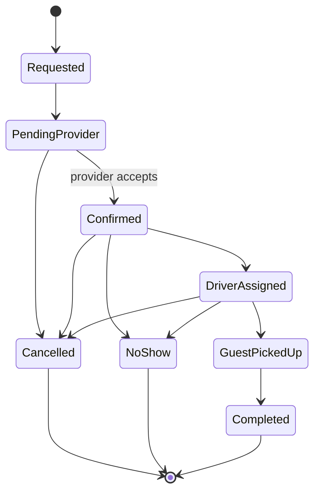
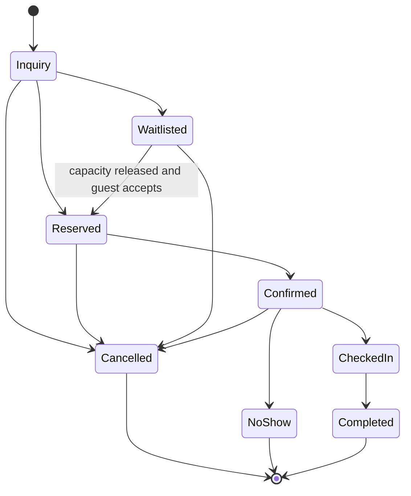
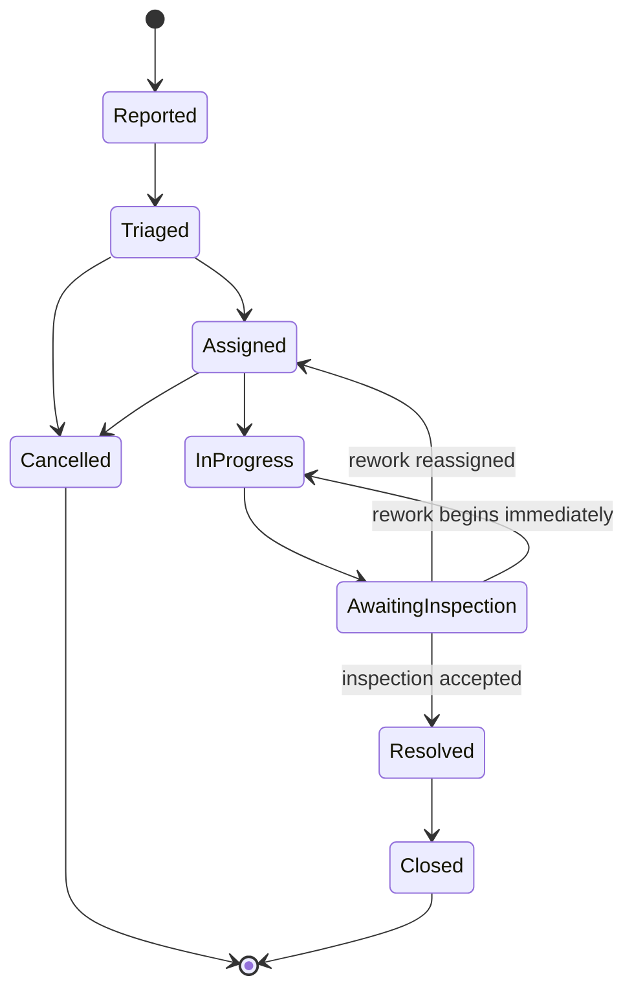
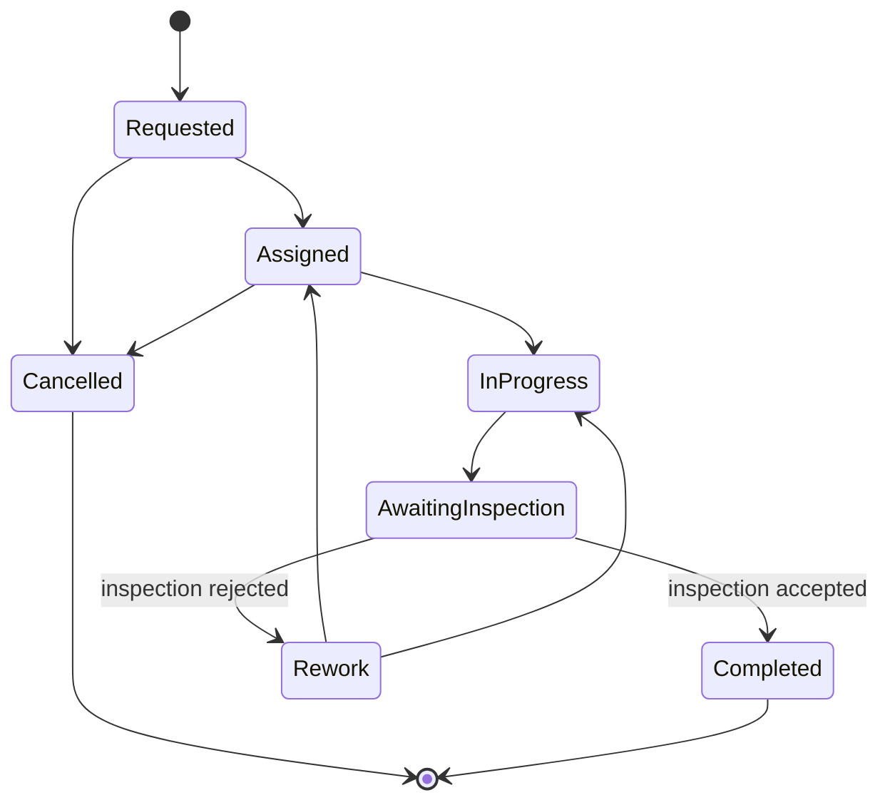

# Services and Operational Work

## Wellness Appointment

```mermaid
stateDiagram-v2
  [*] --> Requested
  Requested --> Waitlisted: no capacity
  Requested --> NeedsSpecialistReview: reported contraindication
  Requested --> Confirmed: capacity and payment condition pass
  Waitlisted --> Confirmed: guest consents; capacity and payment pass
  NeedsSpecialistReview --> Confirmed: specialist approves
  NeedsSpecialistReview --> Cancelled: specialist declines or guest withdraws
  Confirmed --> CheckedIn
  Confirmed --> Cancelled
  Confirmed --> NoShow
  CheckedIn --> InProgress
  InProgress --> Completed
  Cancelled --> [*]
  NoShow --> [*]
  Completed --> [*]
```

`No Show` is allowed only from `Confirmed`. A specialist-review case can be confirmed only after a qualified specialist authorises it. Cancellation/no-show releases the resource slot but does not perform an automatic refund.

## Transfer

## Retreat Registration

## Maintenance

## Housekeeping Task

`Cancelled` is allowed only before `Completed`. Photo evidence is mandatory when the applicable business rule requires it; acceptance/rejection is an authorised inspection action.
