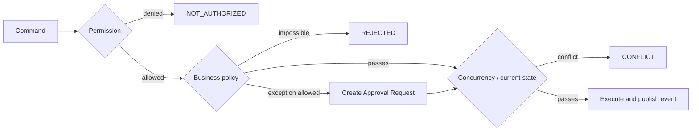

# Command Model

This stage defines every meaningful change as a command with explicit authority, conditions and outcomes. A command expresses intent; an event records the fact that the command succeeded.

## Reading order

1. [Execution contract](execution-contract.md)
2. [Booking and stay commands](booking-and-stay.md)
3. [Rooms, services and work commands](operations-and-services.md)
4. [Finance and approval commands](finance-and-approvals.md)

## Command envelope

Every command carries `commandId`, `actorId`, `actorRole`, `occurredAt`, target aggregate ID, correlation ID and idempotency key. Manual exceptions additionally carry an `Override` object:

```text
reasonCode, comment, actorId, createdAt,
previousValue, newValue, evidence[], approvalId, relatedEntityId
```

`reasonCode` is mandatory. `OTHER` requires a comment.

## Four execution gates



- **Permission denied**: the actor is never allowed to request this action; no approval request is created.
- **Policy exception**: the action could be valid with approval; create a typed approval request.
- **Draft/Pending**: information or an external dependency is incomplete; retain the work without claiming execution.
- **Concurrency conflict**: valid intent lost a race to current state; reject with current alternatives.
